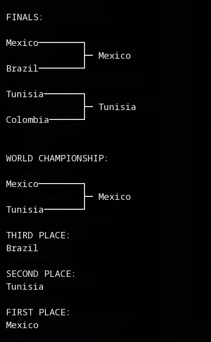

# World Cup Tournament Simulator




### Clone

```
$ git clone git@github.com:brandon-wallace/world_cup_tournament_simulator.git

$ cd world_cup_tournament_simulator/
```

### Compile

```
$ make clean
```

```
$ make
```

### Run

```
$ ./main
```

### Debug

```
$ make debug
```
